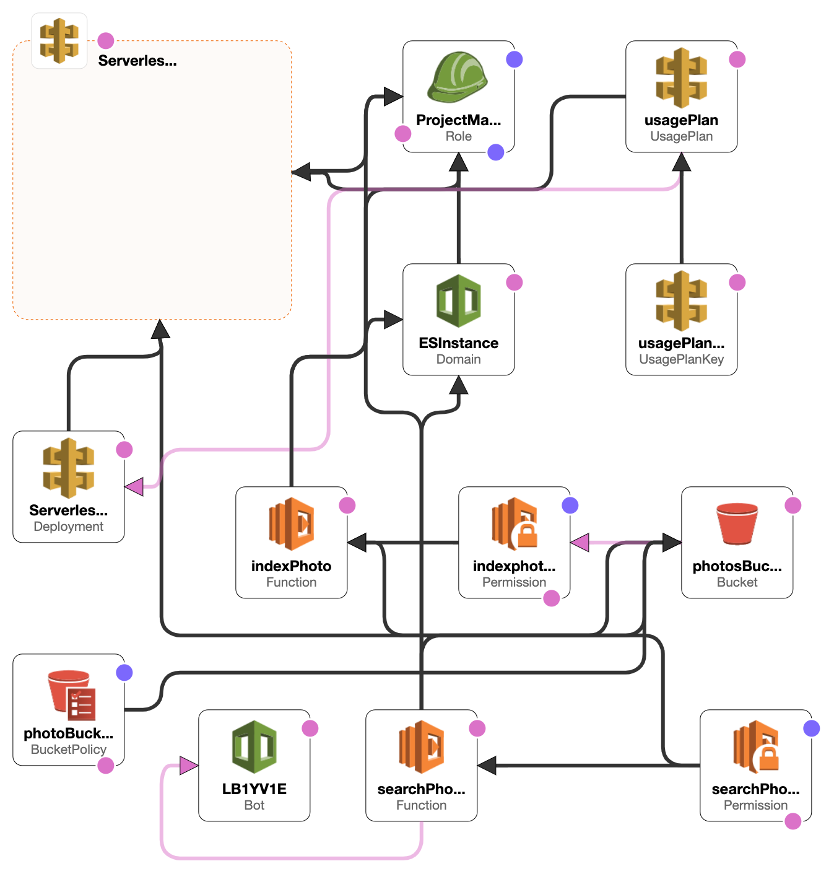
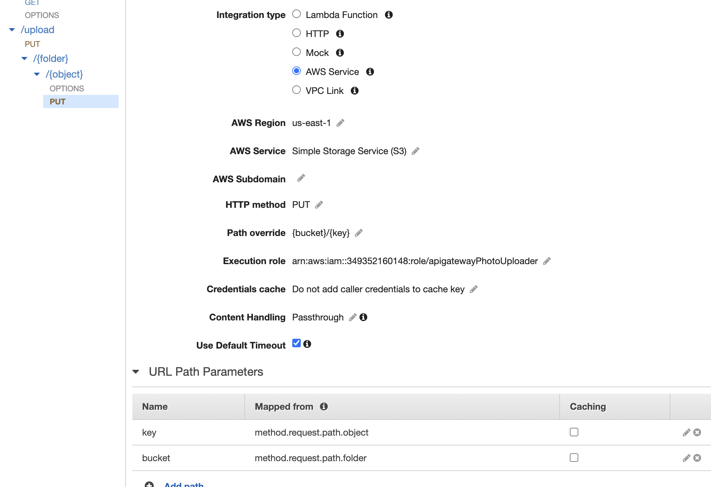
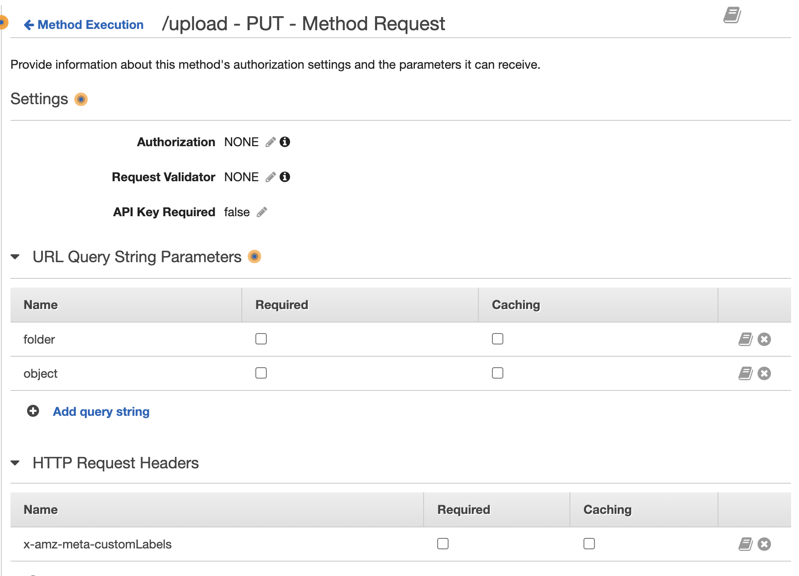
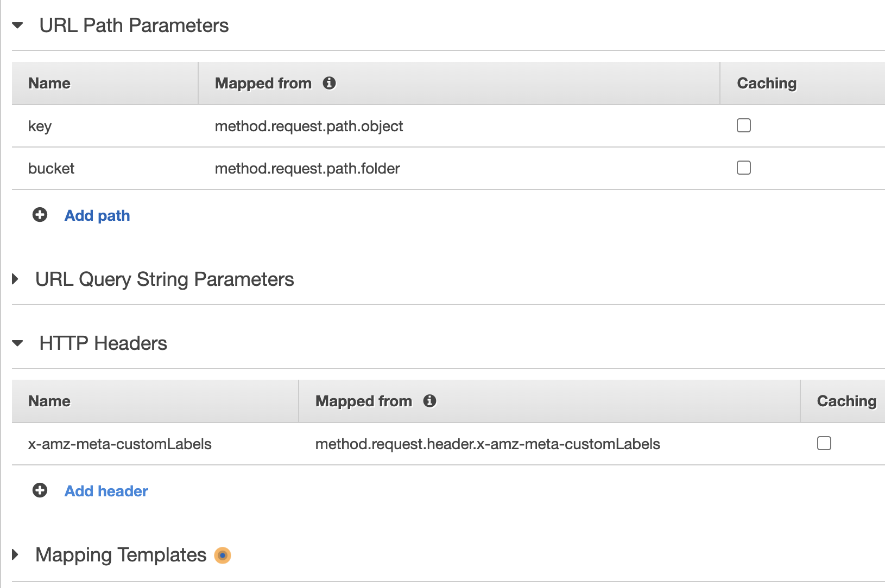

# aws-photo-index
- Automated Picture Classification and AWS Lex integrated Search Engine.
- When a photo is uploaded, a series of tags is detected and stored in S3.
- When query with inputtext, the AWS Lex will process the inputtext and respond with related photos.
- [Here](http://cf-photo-frontend.s3-website-us-east-1.amazonaws.com) deployed one example with vanilla lex bot that only trained with `show me <keyword>`
	- Try or upload a random picture and search with the `show me <class>` that you think the picture belongs to.
	- eg. upload a picture of a rocket and search with `show me rocket`

## Use the follow method to build your own customized one

### Infrastructure Overview
- 

## Express Deploy using [CloudFormation](https://aws.amazon.com/cloudformation)
### Infrastructure Setup
1. Download CFdeploy
2. ~~Create IAM execution role for Lambda, trust service choose Lambda. Attach S3::getobject, S3::putobject, Lex::puttext, rekognition::detectlabel permission. Copy the ARN of the created role. Replace the arn in line 33, 71, 557 of `CloudFormation.json` with new ARN. (Or add the creation of this role to `CloudFormation.json` See [AWS::IAM::role](https://docs.aws.amazon.com/AWSCloudFormation/latest/UserGuide/aws-resource-iam-role.html))~~ (Automated)
3. Create a [S3 bucket](https://docs.aws.amazon.com/AmazonS3/latest/userguide/creating-bucket.html), put LF1.zip and LF2.zip in the bucket. Remember the **bucket name**
4. Create a [API Key](https://docs.aws.amazon.com/apigateway/latest/developerguide/api-gateway-setup-api-key-with-console.html), copy the **API Key ID** for step 6 and **API Key** for step 10.
5. Go to AWS [CloudFormation](https://aws.amazon.com/cloudformation), create new stack using `CloudFormation.json` as template. 
6. There are three parameters to configure the Formation. Make sure to replace `ApikeyID` and `SourceBucket` with the one you created. 
7. `EsKmsKeyId` defines how elastic search perform encryption [AWS KMS](https://docs.aws.amazon.com/kms/latest/developerguide/concepts.html#kms_keys), keep the default value. Start the build infrastructure. The build takes about 15 minutes.
8. Note, For customized usage, the Build of [Lex bot](https://docs.aws.amazon.com/lex/latest/dg/what-is.html) is not included in `CloudFormation.json`. Build a lex bot on AWS Console and replace it's `name` and `alia` to LF2 before use.
### Front Website Setup (Optional)
9. In api gateway console, go to `stage` -> `Alpha` -> `Generate JS SDK`. Use the downloaded SDK to repace the existing one.
10. Replace the api key in line 14, 174 of `frontend/assets/js/chat.js` with the One created
11. Go to S3 console, there will be a new bucket named `photos-bucket-fromcf-<stack name>`. In `chat.js`, set the vallue of `folder` in line 177 with the name of new generated S3 bucket. Replace the `url` in line 168 with `<Invoke URL>/upload`. `<Invoke URL>` can be find in api gateway under stage `Alpha`.
12. Now you can interact with the infrasture in `frontend/index.html`. The backen is initiated with no photos. manually upload to `photos-bucket-fromcf-<stack name>` or use the upload conosle in the `index.html`.
13. ~~SET up API KEY to have fine control of traffic. When deploy ends, go to `API Gateway` -> `CLOUDFORMATION AI Photo Search`. Create New [API KEY and Usage Plan](https://docs.aws.amazon.com/apigateway/latest/developerguide/api-gateway-create-usage-plans.html). Attach Usage Plan to `CLOUDFORMATION AI Photo Search/Alpha`. Attach the API KEY to Usage Plan. Go to Method Request under `get` and `put`. Change `API KEY REQUIRED` to `true`.~~ (Automated)

## Steps for hands on deploy
1. Create New S3, public access, public read policy
2. Create New Opensearch index, make role of LF as master
3. deploy Api Gateway using YAML, Method Request will be generated automatically by YAML
	- Add Integration for GET, PUT
	- For GET
		- Add LF2 as integration
		- Add mapping template application/json Method Request Passthrough
	- For PUT
		- Append x-amz-meta-customLabels to OPTIONS allowed headers
		- Add S3 as integration, add exection role has S3::PutObject permission
		- Add path override and add bucket, key to url path parameters, assign x-amz-meta-customLabels in HTTP Headers
	- Enable CORS
	- In setting, add media type image/jpeg image/png
	- chat.js
		- Change `upload URL` to new api gateway and `folder` to new S3
	- LF1: change Opensearch host, add S3 create as trigger
	- LF2: change Openserach host and S3 url to get image from new S3

## API GATEWAY SET UP:
1. Create or import Yaml
2. Create Resources
	- ex. `/{folder}/{object}`	you can refer them in Integration part by `method.request.path.folder` and `method.request.path.object` 
	- 
	- Note, the given API yaml is not using path to specify S3 bucket, instead, query strings are used.
3. Create Method
	- ex. `PUT`
4. Modify Method Request to add request `header` | `query string` | `body` that you will sent from client and want to pass to next service
	- 
5. Modify Integration Request to specify how you map the parameter in 4. that are sent from client to the request content that you want to sent to next service
	- ex. `key` = `method.request.path.object`	`path.object` is from 2.
	- Use Path override to add path to the request 
		- ex. {bucket}/{key}	will be added to end of url of the service that api gateway sent request to
	- If the next service don't have a Mapping Templates, add one. Generally application/json Method Request Passthrough will enable you to get these parameters in the service. See [Request Template](https://docs.aws.amazon.com/AWSCloudFormation/latest/UserGuide/aws-properties-apitgateway-method-integration.html#cfn-apigateway-method-integration-requesttemplates)
	- The below is the request content API gateway sent to the service you specified in Ingeration type
	- 
6. If Integration type is AWS service, make sure the execution role has permission you need
7. Enable CORS. Add OPTIONS method and add a 200 Method Response. So that when api is call, options can response and tell client what origin, header, and methods are allowed
8. If you have a media in body, add the media type in setting on the left bar below Dashboard

## Refs
[Deploy package](https://docs.aws.amazon.com/lambda/latest/dg/python-package.html)
`zip -g my-deployment-package.zip es.py`

[Opensearch](https://opensearch.org/docs/latest/opensearch/query-dsl/full-text/#match)

[API gateway query string](https://stackoverflow.com/questions/31329958/how-to-pass-a-querystring-or-route-parameter-to-aws-lambda-from-amazon-api-gatew)

[API Gateway CloudWatch Log](https://aws.amazon.com/premiumsupport/knowledge-center/api-gateway-cloudwatch-logs/)
